# Evonne

---

#### Table of contents 
1. [Description] (#description)
1. [Installation] (#installation)
2. [Getting Started] (#getting-started)
3. [Proof View] (#proof-view)
4. [Ontology View] (#ontology-view)

---

### Description

**Evonne** is a web-application for explaining Description Logic reasoning and ontology debugging.

--

### Installation

1. Download and Install [Docker](https://docs.docker.com/get-docker/) (with recommended installation features).
2. Make sure Docker is running:
	* **Mac / Linux** 

			open -a Docker
		
	* **Windows**
			
			start "" "C:\program files\Docker\Docker Desktop.exe"
	

  		
Show more!

		######Issues related to Hyper-V
		* Docker will not run if **Virtualization** is disabled. To check its status go to *Task Manager* (Ctrl+Shift+Esc), *Performance* and then *Virtualization*.		
		* Make sure that the following Windows features (open *Start Menu*, and type *"Turn Windows features on or off"*) are enabled:
		
				* Virtual Machine Platform
				* Hyper-V
		
		* If *Virtualization* is disabled, please restart the PC and access the BIOS (usually F11 or F12).
		Different manufacturers use different labels (VT-x, SVM, etc.). Usually, this can be found in a CPU-related settings menu.

		######Issues related to WSL2
		* If Docker shows a warning that the installation of WSL2 is not complete, please [downolad](https://docs.microsoft.com/en-us/windows/wsl/install-manual#step-4---download-the-linux-kernel-update-package) and install the latest Linux kernel update package as shown in Step 4.
		
		If there are other issues related to Docker not starting properly, please check the [troubleshooting](https://docs.docker.com/desktop/windows/troubleshoot/) information.
		
		

3. Pull the latest version of [Evonne]() 
4. Go to *evonne* directory, and run the following command in *Terminal* (*cmd* on Windows)
		
		docker build . -t [your username]/evonne
		docker run -dp 7007:3000 [your username]/evonne:latest
		
5. Open a web browser, and type the following URL
		
		http://localhost:7007

--

### Getting Started

To start using **Evonne**, you can either create a new project, or load an already existing one. To create a new project an ontology file need to be selected!

	<kbd>
	  
	  <figcaption align = "center">Evonne - Main Menu</figcaption>
	</kbd>

The tool also comes with some precomputed examples that can be accessed from the *Play Around* section in the main menu.

One an ontology is loaded, a new menu will appear. There, the following input can be specified:

* A *concept inclusion* that needs to be proven,
* the *method* that should be used to generate the proof, and
* an optional *signature file* for specifying known terms.

	<kbd align="center">
	  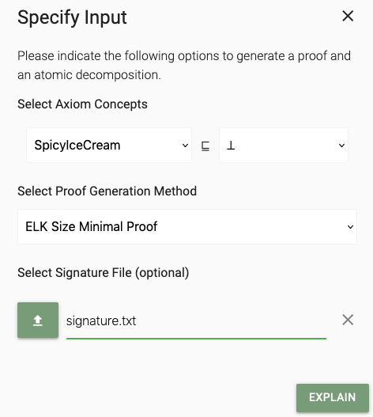
	  <figcaption align = "center">Evonne - Input Menu</figcaption>
	</kbd>

By clicking the *explain* button, both the proof and the ontology views will be populated with the computed structures.

	<kbd align="center">
	  
	  <figcaption align = "center">Evonne - Overview</figcaption>
	</kbd>

In the top right corner, the *menu bar* is located. Buttons from left to right are the following:

	<kbd align="center">
	  
	  <figcaption align = "center">Evonne - Menu Bar Buttons</figcaption>
	</kbd>

1. Input Menu 
2. Proof Menu
3. Ontology Menu
4. Diagnoses Menu
5. Settings Menu

By default, the *proof* and *ontology* views are displayed side-by-side in the same tab (as shown in the overview screenshot).
Exporting a proof (similarly an ontology) graph to a separate tab can be achieved by clicking  which is located in the proof (ontology) menu. Each of the views is equipped with a *mini-map* that can be activated / deactivated from the corresponding menu by clicking .

--

### Proof View

Every proof has exactly one *purple* node representing the final conclusion. *Green* nodes in a proof represent axioms asserted in the ontology and from which the final conclusion is derived. *Blue* nodes represent inferred axioms. *Gray* nodes represent the label of a logical inference. Clicking a gray node shows a tool-tip that contains more details about an inference. 

	<kbd align="center">
	  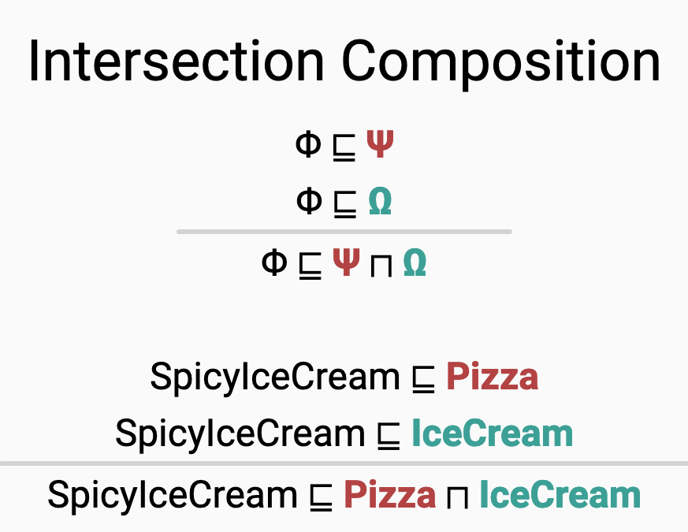
	  <figcaption align = "center">Proof - Intersection Composition</figcaption>
	</kbd>

Currently, this feature is only available for proofs generated using a method that uses the *ELK reasoner*. lastly, *dark gray* nodes, labelled with "*Known*", represent the condensed parts of a proof due to the uploaded *signature* file.

Clicking on an edge that has an axiom node as its source *cuts* the subproof (subtree) from the original structure and displays it on its own. Clicking on the newly added root node  restores the original proof.

Every axiom node in a proof is equipped with its own buttons and are the following:

	<kbd align="center">
	  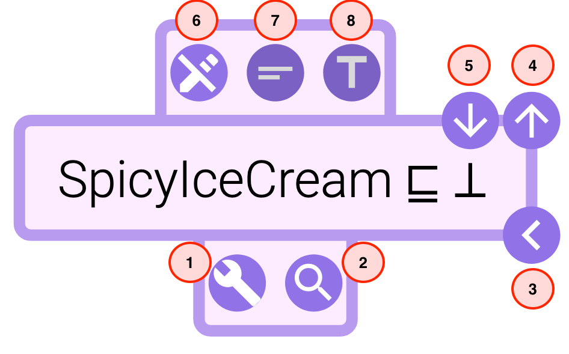
	  <figcaption align = "center">Proof - Axiom Node Buttons</figcaption>
	</kbd>

* *Navigation Buttons* (Buttons 3, 4 and 5) which manipulate the structure of a proof (available on *hover*)
	
	* **Show Previous** (Button 3): Clicking this button hides all inferences in the corresponding subtree except the immediate inference.
	* **Show All Previous** (Button 4): Clicking this button shows all inferences in the corresponding subtree.
	* **Hide All Previous** (Button 5): Clicking this button hides all inferences in the corresponding subtree.

* *Communication Buttons* (Buttons 1 and 2) which trigger functionalities displayed in the *ontology* view (available on *double click*)

	* **Compute Diagnoses** (Button 1): Clicking this button triggers the computation of all minimal diagnoses of the corresponding axiom. These diagnoses are grouped by size and displayed in the *diagnoses menu* located in the ontology view.
	
	

		<kbd align="center">
		  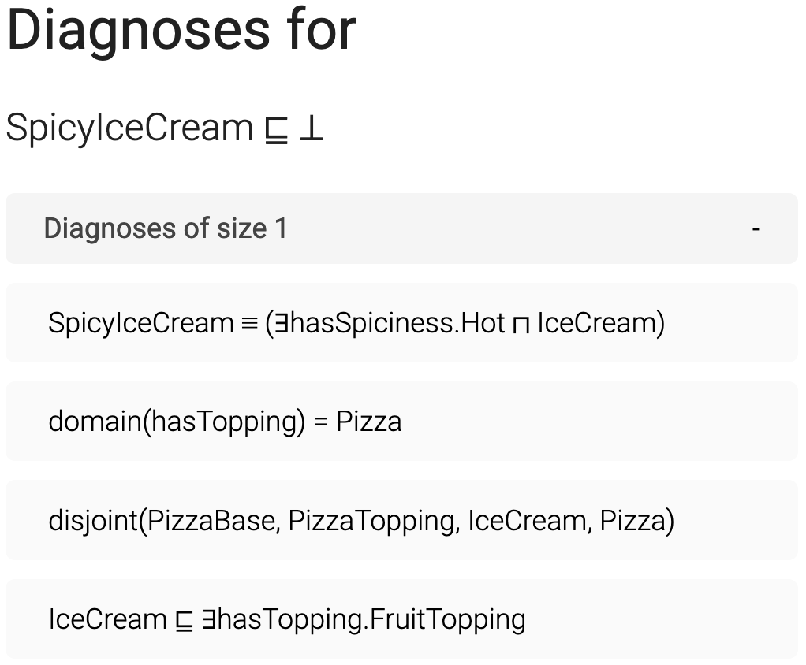
		  <figcaption align = "center">Ontology - Diagnoses Menu</figcaption>
		</kbd>
	

	
	* **Highlight Justification** (Button 2): Clicking this button highlights the ontology axioms used to generate the current proof as well as the nodes that contain them in the *ontology* view. 

* *Format Buttons*
	
	* **Show Original** (Button 6): Clicking this button restores the axiom to its default format (*Description Logic* syntax).
	* **Shorten Axiom** (Button 7): Clicking this button shortens all concepts appearing in the corresponding axiom according to the selected *shortening method*. Currently, there are two shortening methods available and can be selected from the *general* section in the *settings menu*. The available methods are:
		
		* *Camel Case Shortening* (The default shortening method). This method abbreviate words based on capitalized letter
		* *Fixed Length Shortening*. This method shortens all concepts to certain number of characters. The number of characters can be adjusted by the user.
		Note that when shortening two or more concepts leads to identical results, unique *numbers* will be appended to them as suffixes.
	* **Textualize Axiom** (Button 8): Clicking this button translate the axiom into simple *natural language* text.

By default, proofs are displayed using a standard *tree layout*. There are two other layout options (*Linear Proof* and *Magic Mode*) that can be found in the proof section of the *settings menu*.

Nodes are ordered vertically in a linear proof, and gray nodes are dropped. instead, the **Highlight Inference** button  is added to axiom nodes. Clicking this button triggers the same functionality of gray nodes in the standard tree proof, and in addition, it highlights nodes and edges that correspond to the current inference in the proof graph.

By default, nodes in a linear Proof are arranged in a way that prevents edges from intersecting. This can lead to large distance between nodes that constitute an inference. By toggling *optimize premise distance*, the nodes are rearranged in a fashion that minimizes that distance.

	<kbd align="center">
		<kbd align="center">
		  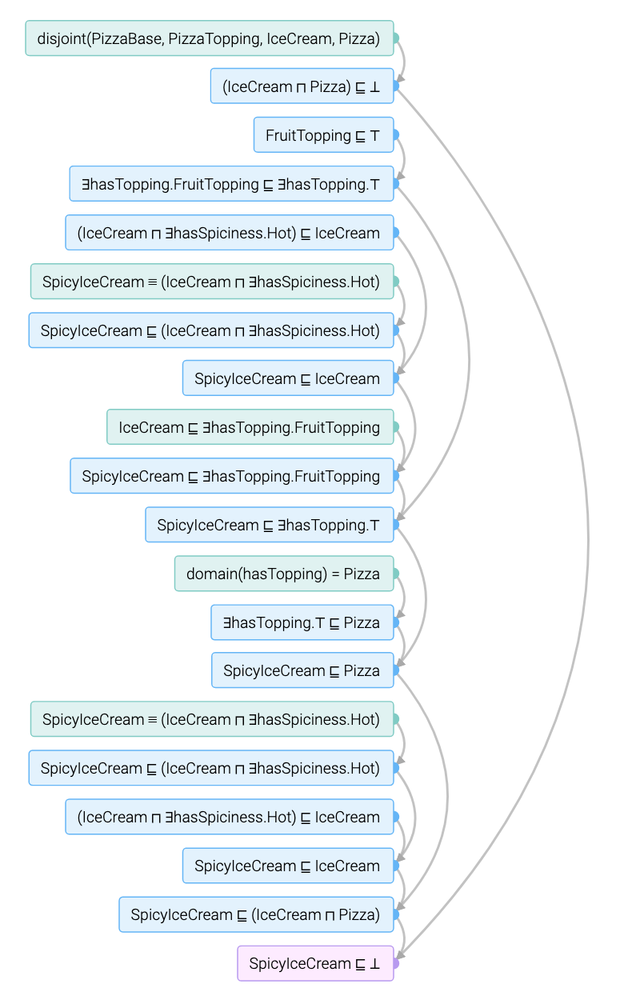
	  	</kbd>
	  	<kbd align="center">
		  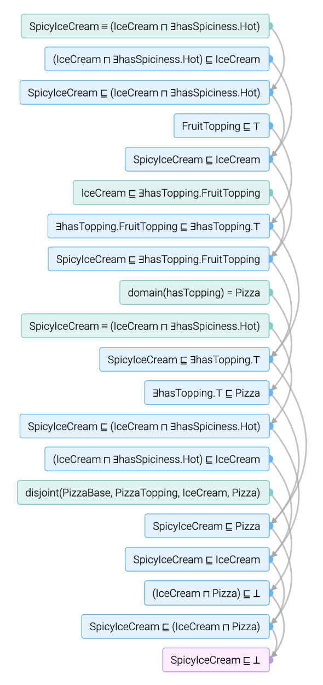
		</kbd>
		<figcaption align = "center">Linear Proof - Planar (left), Optimized Premise Distance (right) </figcaption>
	</kbd>

The proof layout in the *magic mode* is a special tree layout that allows the exploration of the proof in both directions (bottom-up and top-down). 
The initial state a proof in this mode summarizes the entire proof to a single **Magic** inference.

	<kbd align="center">
	  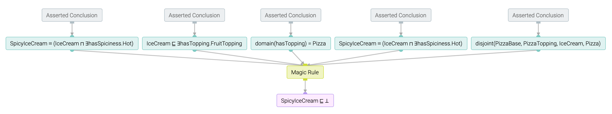
	  <figcaption align = "center">Magic Proof - Initial State</figcaption>
	</kbd>

The *Navigation Buttons* of axiom nodes get replaced by the following buttons:

	<kbd align="center">
	  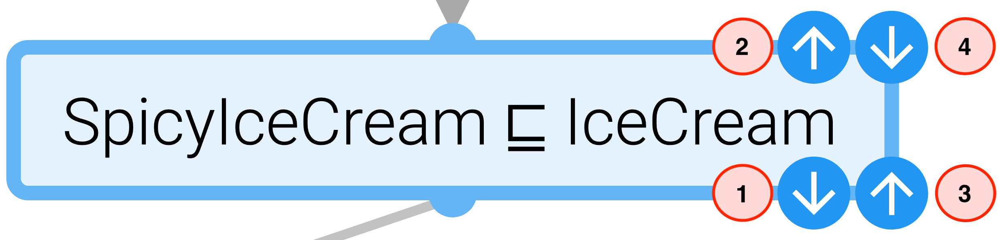
	  <figcaption align = "center">Proof - Axiom Node Buttons</figcaption>
	</kbd>

* **Pull Down** (Button 1): Clicking this button *pulls* an inference out of a *magic* box located *above* the current node. This inference has the current node as a **conclusion**.
* **Pull Up** (Button 2): Clicking this button *pulls* an inference out of a *magic* box located *below* the current node. This inference has the current node as a **premise**.
* **Push Up** (Button 3): Clicking this button *pushes* an inference in a *magic* box located *above* the current node. This inference has the current node as a **premise**.
* **Push Down** (Button 4): Clicking this button *pushes* an inference in a *magic* box located *below* the current node. This inference has the current node as a **conclusion**.

	<kbd align="center">
	  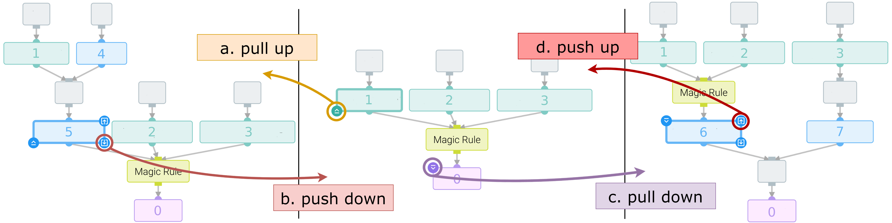
	  <figcaption align = "center">Magic Proof - Push and Pull Actions</figcaption>
	</kbd>

Basically, a *push* action hides an inference, whereas a *pull* action shows an inference. Note that *pull* actions can eliminate *magic rule* nodes, and *push* actions can create new ones.

By default, Evonne fits the entirety of a proof inside the proof view which can lead to an overlap of nodes. Adjusting the *hight* and *width* of a proof can be done from the compactness subsection in the *settings menu*. However, by toggling off the *overlap allowed* option in the setting menu, Evonne disregards the borders of a proof graph and place all nodes without having them overlap.

--
  
### Ontology View

In this view, an ontology is represented as an acyclic directed graph that illustrates a dependency between groups of ontology axioms (nodes). Initially, these groups are summarized by the **signature** of their axioms while taking the dependency of nodes into consideration.

	<kbd align="center">
		<kbd align="center">
		  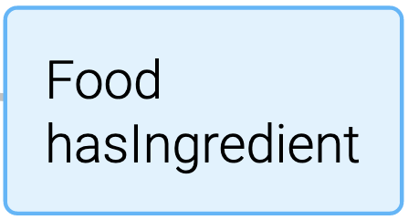
	  	</kbd>
	  	<kbd align="center">
		  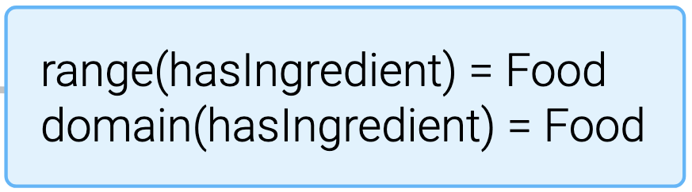
		</kbd>
		<figcaption align = "center">Ontology - Same Node, Signature (left), Full Axioms (right) </figcaption>
	</kbd>

This can be toggled of in the ontology section of the *settings menu* which reveals the axioms of all nodes in the ontology graph.

It is also possible to limit the number of characters per line in an ontology node which can be activated by toggling the *line wrap* option. Currently,  shortening axioms in the ontology view can only be done globally from the settings menu. 

In the *layout simulation* subsection of the ontology view setting, the following parameters can be adjusted:
	
* Flow direction
* Flow strength
* Link length function
* Link ideal length

When a **Highlight Justification** button is clicked in the proof view, the axioms of the justification used to prove the axiom of that node, as well as the nodes of the justification axioms will be highlighted. 

	<kbd align="center">
	  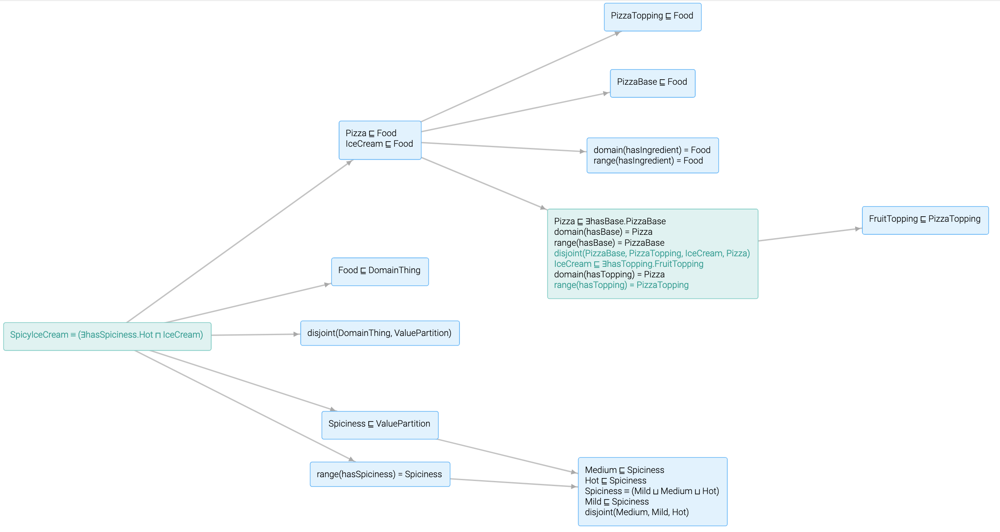
	  <figcaption align = "center">Ontology - Highlight Justification</figcaption>
	</kbd>

 

When a **Compute Diagnoses** button is clicked, the *diagnoses menu* in the ontology view is populated. *Clicking* or *Hovering* over a *diagnosis*, highlights the nodes that will be affected by modifying the axioms of this diagnosis in the ontology. 
 

	<kbd align="center">
	  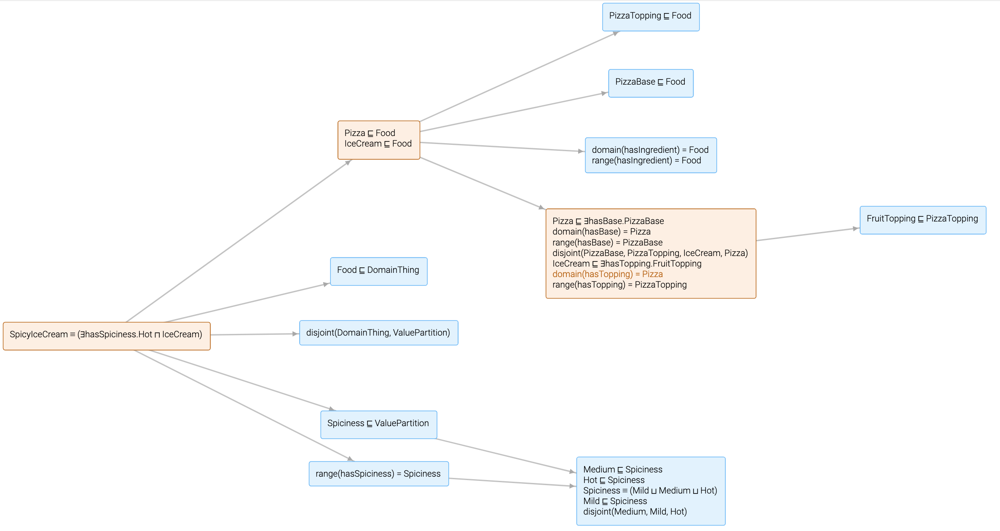
	  <figcaption align = "center">Ontology - Diagnosis Impact</figcaption>
	</kbd>

 
 
The list of diagnoses can be filtered by *locking* nodes (right click) in the ontology graph. Locking means that all axioms of a node must not be changed, hence removing all diagnoses that affect these axioms. 

---

Feel free to contact us regarding any issue you encounter. It would be great if you could also include the server output log! If you would like to do so please follow these steps:

1. Go to Docker app, and locate the **Containers / Apps** menu.
2. Select the container that shows next to its label **[your username] / evonne**.
3. Click the *copy to clipboard* button. 

	

4. Go to any text editor, past the copied text and save it to a new file. 