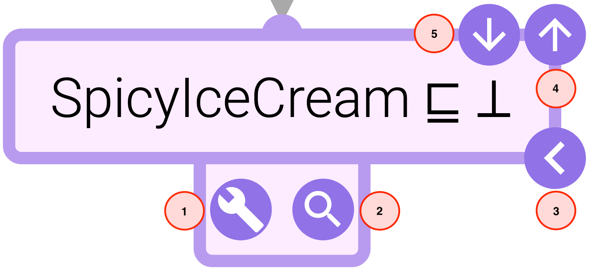

# Evonne

----

#### Table of contents
- [Description](#description)
- [Installation](#installation)
- [Getting Started](#getting-started)
- [Proof View](#proof-view)
- [Ontology View](#ontology-view)

----
### Description

**Evonne** is a web-application for explaining Description Logic reasoning and ontology debugging.
---

### Getting Started

To start using **Evonne**, you can either create a new project, or load an already existing one. To create a new project, the following two arguments need to be specified: an ontology file (.owl or .xml), and a reasoner (ELK or Hermit).

	<figure>
	  
	  <figcaption align = "center">Evonne - Main Menu</figcaption>
	</figure

The tool also comes with some precomputed examples that can be accessed from the *Play Around* section in the main menu.

Once an ontology is loaded, a new menu will appear. There, the following input can be specified:

* a *concept inclusion* that needs to be proven,
* the *method* that should be used to generate the proof, and
* an optional *signature file* for specifying known terms.

	<figure align="center">
	  
	  <figcaption align = "center">Evonne - Input Menu</figcaption>
	</figure

By clicking the *explain* button, both the proof and the ontology views will be populated with the computed structures.

Note: concepts and proof generation methods that are available in this menu depend on the reasoner selection in the previous step.

	<figure align="center">
	  
	  <figcaption align = "center">Evonne - Overview</figcaption>
	</figure

In the top right corner, the *menu bar* is located. Buttons from left to right are the following:

	<figure align="center">
	  
	  <figcaption align = "center">Evonne - Menu Bar Buttons</figcaption>
	</figure

1. Input Menu 
2. Proof Menu
3. Ontology Menu
4. Diagnoses Menu
5. Settings Menu

By default, the *proof* and *ontology* views are displayed side-by-side in the same tab (as shown in the overview screenshot).
Exporting a proof (similarly an ontology) graph to a separate tab can be achieved by clicking  which is located in the proof (ontology) menu. Each of the views is equipped with a *mini-map* that can be activated / deactivated from the corresponding menu by clicking .

---

### Proof View

Every proof has exactly one *purple* node representing the final conclusion. *Green* nodes in a proof represent axioms asserted in the ontology and from which the final conclusion is derived. *Blue* nodes represent inferred axioms. *Gray* nodes represent the label of a logical inference. Clicking a gray node shows a "Rule Explanation" tooltip that contains more details about an inference. 

	<figure align="center">
	  
	  <figcaption align = "center">Intersection Composition - Rule Explanation Tooltip</figcaption>
	</figure

Currently, this feature is only available for proofs generated using a method that uses the *ELK reasoner*. lastly, *dark gray* nodes, labelled with "*Known*", represent the condensed parts of a proof due to the uploaded *signature* file.

Clicking on an edge that has an axiom node as its source *cuts* the subproof (subtree) from the original structure and displays it on its own. Clicking on the newly added root node  restores the original proof.

Every axiom node in a proof is equipped with its own buttons and are the following:

	<figure align="center">
	  
	  <figcaption align = "center">Proof - Axiom Node Buttons</figcaption>
	</figure

* *Navigation Buttons* (Buttons 3, 4 and 5) which manipulate the structure of a proof (available on *hover*)
	
	* **Show Previous** (Button 3): clicking this button hides all inferences in the corresponding subtree except the immediate inference.
	* **Show All Previous** (Button 4): clicking this button shows all inferences in the corresponding subtree.
	* **Hide All Previous** (Button 5): clicking this button hides all inferences in the corresponding subtree.

* *Communication Buttons* (Buttons 1 and 2) which trigger functionalities displayed in the *ontology* view (available on *double click*)

	* **Compute Diagnoses** (Button 1): clicking this button triggers the computation of all minimal diagnoses of the corresponding axiom. These diagnoses are grouped by size and displayed in the *diagnoses menu* located in the ontology view.
	
	
		<figure align="center">
		  
		  <figcaption align = "center">Ontology - Diagnoses Menu</figcaption>
		</figure>
	
	* **Highlight Justification** (Button 2): clicking this button highlights the ontology axioms used to generate the current proof as well as the nodes that contain them in the *ontology* view. 

Axiom nodes are also equipped with a *context menu*. In addition to the functionalities of the previously mentioned buttons, this menu gives access to the following *formatting functions*:
	
* **Shorten Axiom**: this shortens all concepts appearing in the corresponding axiom according to the selected *shortening method*. Currently, there are two shortening methods available and can be selected from the *general* section in the *settings menu*. The available methods are:
	
	* *Camel Case Shortening* (The default shortening method). This method abbreviate words based on capitalized letter
	* *Fixed Length Shortening*. This method shortens all concepts to certain number of characters. The number of characters can be adjusted by the user.
	Note that when shortening two or more concepts leads to identical results, unique *numbers* will be appended to them as suffixes.
* **Textualize Axiom**: this translates the axiom into a simple *natural language* text.
* **Show Original**: this restores the axiom to its default format (*Description Logic* syntax).

By default, proofs are displayed using a standard *tree layout*. There are two other layout options (*Linear Proof* and *Magic Mode*) that can be found in the proof section of the *settings menu*.

Nodes are ordered vertically in a linear proof, and gray nodes are dropped. instead, the **Highlight Inference** button  is added to axiom nodes. Clicking this button triggers the same functionality of gray nodes in the standard tree proof, and in addition, it highlights nodes and edges that correspond to the current inference in the proof graph.

By default, nodes in a linear Proof are arranged in a way that prevents edges from intersecting. This can lead to large distance between nodes that constitute an inference. By toggling *optimize premise distance*, the nodes are rearranged in a fashion that minimizes that distance.

	<figure align="center">
		<figure align="center">
		  
	  	</figure>
	  	<figure align="center">
		  
		</figure>
		<figcaption align = "center">Linear Proof - Planar (left), Optimized Premise Distance (right) </figcaption>
	</figure

The proof layout in the *magic mode* is a special tree layout that allows the exploration of the proof in both directions (bottom-up and top-down). 
The initial state a proof in this mode summarizes the entire proof to a single **Magic** inference.

	<figure align="center">
	  
	  <figcaption align = "center">Magic Proof - Initial State</figcaption>
	</figure

The *Navigation Buttons* of axiom nodes get replaced by the following buttons:

	<figure align="center">
	  
	  <figcaption align = "center">Proof - Axiom Node Buttons</figcaption>
	</figure

* **Pull Down** (Button 1): clicking this button *pulls* an inference out of a *magic* box located *above* the current node. This inference has the current node as a **conclusion**.
* **Pull Up** (Button 2): clicking this button *pulls* an inference out of a *magic* box located *below* the current node. This inference has the current node as a **premise**.
* **Push Up** (Button 3): clicking this button *pushes* an inference in a *magic* box located *above* the current node. This inference has the current node as a **premise**.
* **Push Down** (Button 4): clicking this button *pushes* an inference in a *magic* box located *below* the current node. This inference has the current node as a **conclusion**.

	<figure align="center">
	  
	  <figcaption align = "center">Magic Proof - Push and Pull Actions</figcaption>
	</figure

Basically, a *push* action hides an inference, whereas a *pull* action shows an inference. Note that *pull* actions can eliminate *magic rule* nodes, and *push* actions can create new ones.

By default, Evonne fits the entirety of a proof inside the proof view which can lead to an overlap of nodes. Adjusting the *hight* and *width* of a proof can be done from the compactness subsection in the *settings menu*. However, by toggling off the *overlap allowed* option in the setting menu, Evonne disregards the borders of a proof graph and place all nodes without having them overlap.

---
  
### Ontology View

In this view, an ontology is represented as an acyclic directed graph that illustrates a dependency between groups of ontology axioms (nodes). Initially, these groups are summarized by the **signature** of their axioms while taking the dependency of nodes into consideration.

	<figure align="center">
		<figure align="center">
		  
	  	</figure>
	  	<figure align="center">
		  
		</figure>
		<figcaption align = "center">Ontology - Same Node, Signature (left), Full Axioms (right) </figcaption>
	</figure

This can be toggled of in the ontology section of the *settings menu* which reveals the axioms of all nodes in the ontology graph.

It is also possible to limit the number of characters per line in an ontology node which can be activated by toggling the *line wrap* option. Currently,  shortening axioms in the ontology view can only be done globally from the settings menu. 

In the *layout simulation* subsection of the ontology view setting, the following parameters can be adjusted:
	
* Flow direction
* Flow strength
* Link length function
* Link ideal length

When a **Highlight Justification** button is clicked in the proof view, the axioms of the justification used to prove the axiom of that node, as well as the nodes of the justification axioms will be highlighted. 

	<figure align="center">
	  
	  <figcaption align = "center">Ontology - Highlight Justification</figcaption>
	</figure 

When a **Compute Diagnoses** button is clicked, the *diagnoses menu* in the ontology view is populated. *Clicking* or *Hovering* over a *diagnosis*, highlights the nodes that will be affected by modifying the axioms of this diagnosis in the ontology. 
 

	<figure align="center">
	  
	  <figcaption align = "center">Ontology - Diagnosis Impact</figcaption>
	</figure 
 
The list of diagnoses can be filtered by *locking* nodes (right click) in the ontology graph. Locking means that all axioms of a node must not be changed, hence removing all diagnoses that affect these axioms.

Note: by default, the computation of diagnoses depends on the reasoner that was selected when the project was first created. However, this can be changed from the diagnoses subsection in the ontology section of the *settings menu*.

---

Feel free to contact us regarding any issue you encounter. It would be great if you could also include the server output log! If you would like to do so, please follow these steps.

1. Go to Docker app, and locate the **Containers / Apps** menu.
2. Select the container that shows next to its label **[your username] / evonne**.
3. Click the *copy to clipboard* button. 

	

4. Go to any text editor, past the copied text and save it to a new file. 